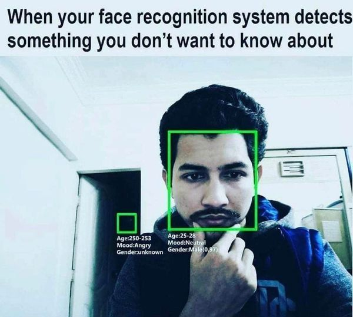

# Face Recognition
Delaram's Optimization Course Project

## Introduction

In this project we're going to implement a face recognition system. Our face recognizer is going to use a bunch of cool theories to recognize a face. Let's discuss them.

1. Data Collection
2. Data Preprocessing
3. Finding eigenfaces using PCA
4. Face Recognition using ensemble of classifiers

## Data Collection

We're going to use the [CelebA](http://mmlab.ie.cuhk.edu.hk/projects/CelebA.html) dataset. It contains 202,599 images of 10,177 celebrities. It has 5 landmark locations, 40 binary attribute annotations per image and 10,000 celebrity names.

## Data Preprocessing

Since we're using CelebA dataset, we must preprocess the data to make it suitable for our face recognition system. First of all, since faces are not contained in the majority of image in most images, we would crop the images to only contain the face. We would be using OpenCV's face detection algorithm to do so. Then we would resize the images to 64x64 pixels. This is because we're going to use PCA to find the eigenfaces and PCA is computationally expensive. So we would like to reduce the number of pixels as much as possible.

## Finding eigenfaces using PCA

We're going to use PCA to find the eigenfaces. We would use the following steps to do so:

1. Calculate the mean face
2. Calculate the covariance matrix
3. Calculate the eigenvalues and eigenvectors of the covariance matrix
4. Sort the eigenvalues and eigenvectors in descending order
5. Select the top k eigenvectors
6. Calculate the eigenfaces

## Face Recognition using ensemble of classifiers

We're going to use a bunch of classifiers to recognize a face. We would use the following classifiers:

1. Logistic Regression
2. SVM
3. KNN

To have the final prediction we would use ensemble learning.

